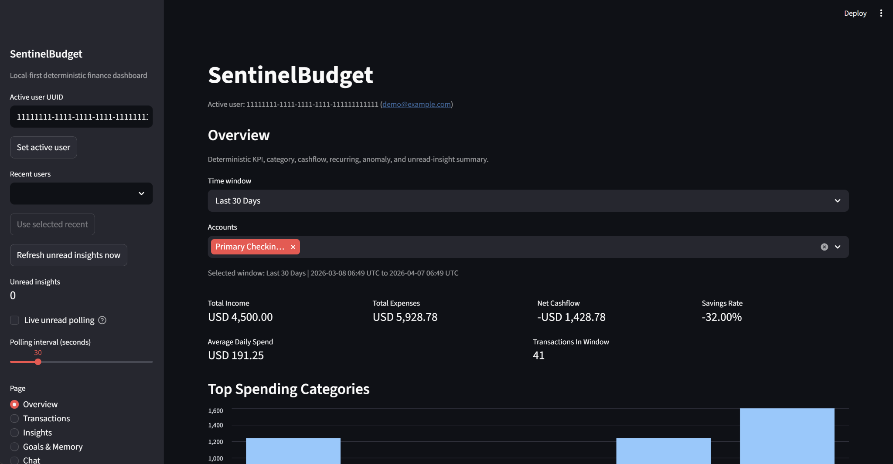
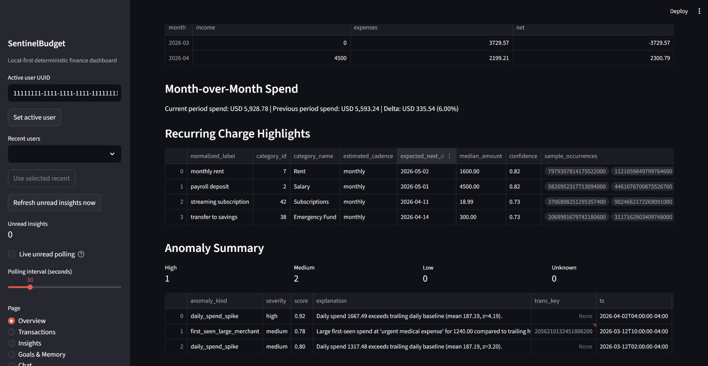
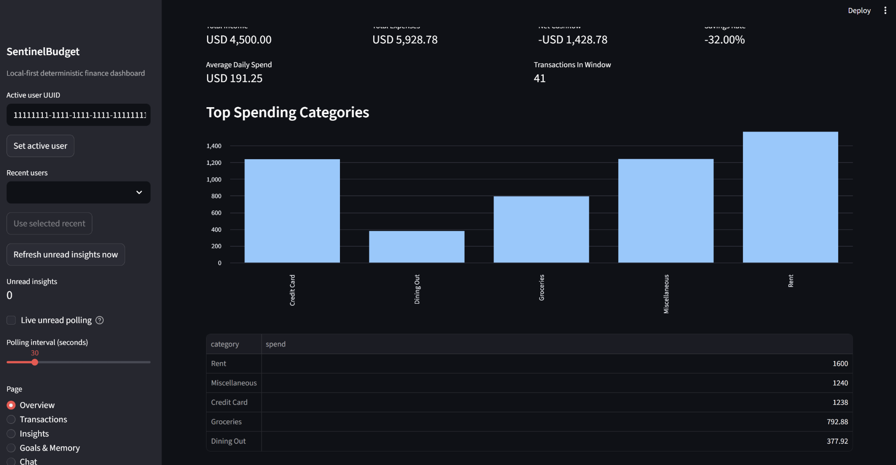
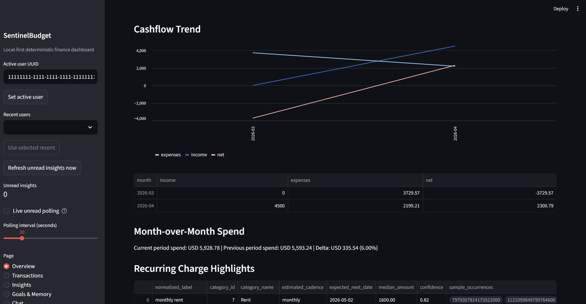
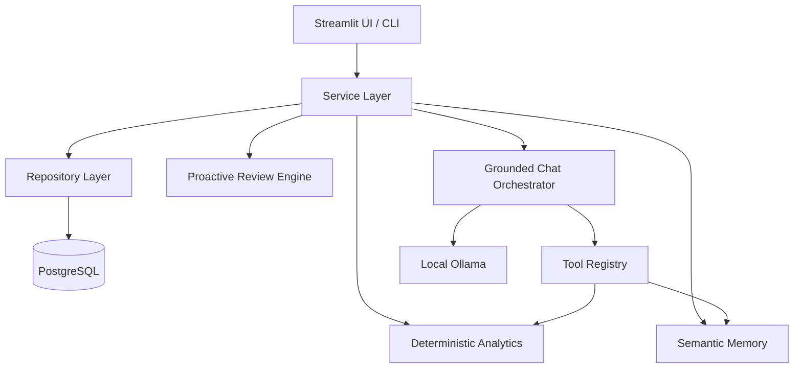

# SentinelBudget

<p align="center">
  <strong>Local-first proactive finance agent with deterministic analytics, grounded AI chat, semantic memory, and a self-hosted review workflow.</strong>
</p>

<p align="center">
  Built with Python, PostgreSQL + pgvector, Ollama, and Streamlit.
</p>

<p align="center">
  
  
  
  
  
  
</p>

---

## Overview

SentinelBudget is a **local-first personal finance agent** designed to combine **deterministic financial analytics** with **grounded LLM interaction**.

Most finance tools can show charts. Fewer can explain *why something matters*, *surface proactive insights*, and *do it without handing your data to a hosted AI service*. SentinelBudget is built around that gap.

The system keeps **financial logic deterministic and testable**, while using a **local LLM through Ollama** for phrasing, chat interaction, and memory-backed assistance. The result is a project that is privacy-conscious, inspectable, and practical for reviewers who want something more credible than “AI but with a dashboard.”

---

## Product Screenshots

### Overview dashboard



### Filtered overview and KPI summary



### Cashflow trend and recurring charge analysis



### Category spend breakdown



---

## Why This Project Exists

SentinelBudget was built around a few core principles:

- **Local-first by default**  
  Financial data and inference stay on your machine.

- **Deterministic where correctness matters**  
  KPI calculations, recurring detection, anomaly logic, deduplication, and review generation are built from explicit service logic rather than model guesswork.

- **Grounded AI instead of free-form AI**  
  Chat is tied to tool outputs, evidence, and service boundaries to reduce hallucinated finance advice.

- **Evaluator-friendly developer experience**  
  The repo includes explicit CLI entrypoints, preflight checks, database initialization, deterministic demo bootstrap, and testable layers.

- **Maintainable architecture**  
  The codebase separates UI, services, repositories, analytics, review workflows, and agent orchestration into clear boundaries.

---

## Key Capabilities

### 1. Transaction ingestion and normalization
- Ingests CSV and synthetic transaction data
- Normalizes raw records into a canonical transaction shape
- Applies deterministic deduplication and controlled quarantine behavior for noisy inputs

### 2. Deterministic analytics
- Generates KPI summaries over defined time windows
- Identifies recurring transaction candidates
- Flags anomaly events through reproducible transformation logic

### 3. Semantic memory with pgvector
- Stores user goals and preference-style context
- Supports vector-backed retrieval for better continuity in grounded interactions
- Validates embedding dimensions and search flow through service and repository boundaries

### 4. Grounded chat orchestration
- Executes tool-backed chat turns
- Preserves history and provenance
- Returns warnings and evidence instead of pretending uncertainty does not exist

### 5. Proactive review engine
- Produces daily or weekly-style insights
- Persists unread findings
- Avoids duplicate insight spam using fingerprint-based idempotency

### 6. Local UI and CLI workflows
- Streamlit UI for local exploration
- CLI commands for setup, ingestion, analytics, memory sync, chat, review, and health checks
- Designed so major flows can run without depending on the UI

---

## Architecture



### Design decisions
- **Deterministic-first pipeline** for ingestion, analytics, review findings, and deduplication
- **Repository boundary** to make database side effects explicit and testable
- **Provider abstraction** for local model integration and safer fallback behavior
- **CLI-first operability** so flows are inspectable outside the UI
- **Preflight checks and structured logging** for clearer setup and runtime diagnostics

---

## Tech Stack

| Layer | Technology |
|---|---|
| Language | Python 3.11 |
| Database | PostgreSQL 16+ |
| Vector storage | pgvector |
| Migrations | Alembic |
| Local LLM runtime | Ollama |
| UI | Streamlit |
| Validation / config | Pydantic, pydantic-settings |
| Quality gates | Ruff, Mypy, Pytest |
| Packaging / workflow | `uv` |

---

## Project Structure

```text
.github/workflows/            CI workflows
migrations/                   Alembic environment and revisions
scripts/                      Helper scripts and utilities
sentinelbudget/               Core backend package
  agent/                      Grounded chat orchestration, providers, tools, history
  analytics/                  KPI, recurring, and anomaly logic
  db/                         Engine, schema bootstrap, repositories
  demo/                       Deterministic demo bootstrap workflow
  ingest/                     Loaders, normalization, validation, dedup, synthetic data
  memory/                     Embeddings and semantic memory services
  review/                     Proactive review generation and daemon logic
tests/                        Unit, integration, and smoke tests
ui/                           Streamlit app shell, pages, helpers, formatters
```

---

## Quick Start

### Prerequisites

Make sure you have the following installed:

- Python 3.11
- `uv`
- PostgreSQL 16+ with `pgvector`
- Ollama

### 1. Clone the repository

```bash
git clone https://github.com/sundar139/SentinelBudget-Local-Proactive-Finance-Agent.git
cd SentinelBudget-Local-Proactive-Finance-Agent
```

### 2. Install dependencies

```bash
uv sync
```

### 3. Create your environment file

**PowerShell**
```powershell
Copy-Item .env.example .env
```

**Bash**
```bash
cp .env.example .env
```

### 4. Configure environment variables

Fill in the values in `.env`.

Important variables include:

- PostgreSQL connection settings
- Ollama base URL and chat model
- Embedding model and dimensions
- Review daemon scheduling settings

### 5. Run preflight checks

```bash
uv run sentinelbudget-preflight
```

### 6. Initialize the database

```bash
uv run sentinelbudget-db-migrate
uv run sentinelbudget-db-init
```

### 7. Launch the UI

```bash
uv run streamlit run ui/app.py
```

---

## Demo Bootstrap

For a deterministic local demo setup, generate UUIDs and run:

```bash
uv run sentinelbudget-demo-bootstrap --user-id <USER_UUID> --account-id <ACCOUNT_UUID> --seed 42
```

To also sync seeded goals into semantic memory:

```bash
uv run sentinelbudget-demo-bootstrap --user-id <USER_UUID> --account-id <ACCOUNT_UUID> --seed 42 --sync-goals
```

This seeds realistic demo transactions and a small set of goals for evaluator-friendly local testing.

---

## Useful Commands

### Health and setup
```bash
uv run sentinelbudget-healthcheck
uv run sentinelbudget-preflight
uv run sentinelbudget-db-migrate
uv run sentinelbudget-db-init
```

### Data and analytics
```bash
uv run sentinelbudget-ingest synthetic --account-id <ACCOUNT_UUID> --days 90 --seed 42
uv run sentinelbudget-analytics all --user-id <USER_UUID> --window last_30_days
```

### Memory and chat
```bash
uv run sentinelbudget-memory sync-goals --user-id <USER_UUID>
uv run sentinelbudget-chat ask --user-id <USER_UUID> --session-id <SESSION_UUID> --message "Am I overspending this month?"
```

### Review workflows
```bash
uv run sentinelbudget-review list-unread-insights --user-id <USER_UUID> --limit 20
```

---

## Environment Configuration

The repository includes an `.env.example` with the expected runtime settings, including:

- App environment and logging
- PostgreSQL host, port, database, credentials, and SSL mode
- pgvector extension name
- Ollama base URL, chat model, timeout, and agent limits
- Review daemon timing
- Embedding model, timeout, dimensions, and retrieval defaults

This keeps local setup explicit instead of hiding system requirements behind vague startup failures.

---

## Quality and Testing

Run the full quality gate locally:

```bash
uv run ruff check .
uv run mypy sentinelbudget
uv run pytest
```

### Integration tests

**PowerShell**
```powershell
$env:SENTINEL_INTEGRATION_DB = "1"
uv run pytest tests/integration
```

**Bash**
```bash
export SENTINEL_INTEGRATION_DB=1
uv run pytest tests/integration
```

---

## What Makes This Different

SentinelBudget is not trying to be “a chatbot for your finances.”

It is closer to a **local financial reasoning system** with an agent interface layered on top.

That distinction matters:

- The **financial logic is deterministic**
- The **AI layer is grounded**
- The **state is inspectable**
- The **deployment model is self-hosted**
- The **architecture is testable and reviewer-friendly**

That makes it better suited for technical demos, portfolio review, architecture interviews, and local-first AI discussions than a generic LLM wrapper with some charts bolted onto it.

---

## Current Limitations

This project intentionally targets **local and self-hosted execution** first.

A few practical limitations remain:

- Production cloud deployment is not the default path
- Ollama availability and model tags can vary by local machine setup
- Optional components can degrade into warnings, so local environment discipline still matters
- The project should be positioned as a strong working foundation rather than a mature commercial product

---

## Roadmap

Planned directions include:

- stronger integration and CI coverage
- better evaluator assets and demo materials
- improved observability for long-running review workflows
- stricter preflight modes for production-like validation

---

## Ideal Use Cases

- Local-first AI portfolio project
- Technical architecture showcase
- Finance-focused agent systems demo
- Grounded LLM orchestration example
- Personal experimentation with pgvector + Ollama + deterministic analytics
- Interview-ready project demonstrating system design discipline

---

## Repository Status

This repository currently contains:

- backend package structure under `sentinelbudget/`
- Streamlit UI under `ui/`
- tests, migrations, scripts, and CI workflow directories
- a Python 3.11 package with explicit CLI entrypoints and strict typing and tooling orientation

---

## Contributing

If you are extending the project, keep changes aligned with the existing design philosophy:

- preserve deterministic financial logic
- keep model usage grounded and inspectable
- prefer explicit service boundaries over convenience shortcuts
- maintain local reproducibility
- keep quality gates passing before merging

---

## License

This project is licensed under the MIT License. See the [LICENSE](./LICENSE) file for details.

---

## Final Note

SentinelBudget is strongest when presented as a **disciplined local-first AI systems project**, not just a budgeting app.

That is the right story for this repo:
- deterministic core
- grounded agent layer
- privacy-conscious local execution
- clear developer ergonomics
- architecture that stands up in review