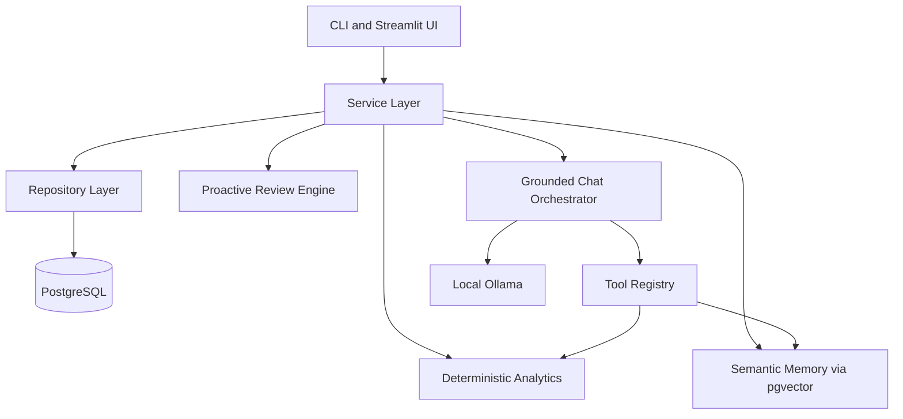

# SentinelBudget


SentinelBudget is a local-first proactive finance agent that combines deterministic financial analytics with grounded LLM wording. It is designed for technical reviewers to clone, run locally, and inspect across CLI, Streamlit UI, and testable service boundaries.

## Project Overview

SentinelBudget solves a common gap in personal-finance tooling: many tools offer dashboards, but few provide reliable, explainable, and locally controlled proactive insights. This project treats deterministic data processing as the source of truth and uses local LLMs only for phrasing and interaction.

Core stack:

- Python 3.11
- PostgreSQL 16+ with pgvector
- Alembic migrations
- Streamlit UI
- Ollama for local chat and embeddings
- Ruff, Mypy, Pytest quality gates

## Motivation And Goals (Why)

- Local-first privacy: keep data and inference local instead of relying on third-party hosted inference.
- Deterministic correctness: financial calculations, deduplication, and anomaly detection are deterministic and testable.
- Grounded AI behavior: chat answers are tied to tool outputs and citations rather than free-form generation.
- Evaluator-ready operations: preflight checks, demo bootstrap command, and explicit CLI entrypoints reduce setup ambiguity.
- Maintainability: repository/service layering and strict QA gates keep changes reviewable and safer over time.

## Architecture And Intentional Design Decisions



Design choices:

- Deterministic-first pipeline: ingestion, analytics, review findings, and dedup fingerprints are deterministic.
- Repository boundary for DB writes and reads: makes side effects explicit and testable.
- Local model integration through provider abstractions: model errors degrade safely to explicit warnings/fallback messaging.
- CLI-first operability: every major workflow is invokable without UI dependencies.
- Structured logging and preflight: failure modes are visible and actionable.

## Features And Implementation Details (What And How)

### 1) Ingestion And Normalization

What it does:

- Ingests CSV and synthetic datasets.
- Normalizes records into canonical transaction shape.
- Applies deterministic dedup and quarantine behavior.

Why implemented this way:

- Financial records often have inconsistent schemas and duplicates.
- Deterministic canonicalization is required before meaningful analytics.

How implemented:

- Canonical ingestion flows in sentinelbudget/ingest.
- Duplicate prevention through trans_key and natural-key checks.
- Quarantine ratio support for controlled failure in dirty datasets.

### 2) Deterministic Analytics

What it does:

- Produces KPI summaries, recurring candidates, and anomaly events.

Why implemented this way:

- Reviewers and users need reproducible, explainable analytics outputs.

How implemented:

- Time-window resolution and KPI computation in sentinelbudget/analytics.
- Recurring and anomaly modules operate on deterministic row transformations.

### 3) Semantic Memory (pgvector)

What it does:

- Stores and retrieves semantically searchable memory items.
- Syncs goals and preferences into vector-backed memory.

Why implemented this way:

- Long-running assistant workflows require contextual recall without dropping to opaque prompt state.

How implemented:

- Embedding provider abstraction with dimension checks.
- Repository-enforced vector search ordering and shape validation.

### 4) Grounded Chat Orchestration

What it does:

- Executes tool-backed chat turns and stores conversation history.
- Returns tool provenance, warnings, and evidence blocks.

Why implemented this way:

- Prevents hallucinated finance answers by binding responses to tool outputs.

How implemented:

- Orchestrator and provider modules in sentinelbudget/agent.
- Tool registry mediates deterministic service calls.
- Safe-fail paths for model/tool outages retain transparency.

### 5) Proactive Review And Insights

What it does:

- Runs daily/weekly review logic and persists unread insights.
- Avoids duplicate insight spam via fingerprint dedup behavior.

Why implemented this way:

- Insight generation must be actionable and non-redundant.

How implemented:

- Review service in sentinelbudget/review composes analytics + memory context + deterministic drafting.
- Insight repository uses uniqueness-safe insert/read behavior for idempotency.

### 6) Streamlit UI

What it does:

- Provides local dashboard pages for overview, transactions, insights, memory, chat, and debug settings.

Why implemented this way:

- Enables fast local exploration while preserving CLI as source-of-truth interfaces.

How implemented:

- UI shell and page modules under ui.
- Service calls flow through existing backend boundaries.
- Graceful fallback paths surface optional dependency or runtime failures clearly.

### 7) Preflight And Demo Bootstrap

What it does:

- Preflight validates config, DB connectivity, schema/migrations, optional model/tooling readiness.
- Demo bootstrap seeds deterministic data and outputs next commands.

Why implemented this way:

- Reduces evaluator setup failures and makes local onboarding repeatable.

How implemented:

- sentinelbudget-preflight and sentinelbudget-demo-bootstrap entrypoints.
- Distinct hard-failure versus warning semantics in preflight summary output.

## Challenges And Issues Encountered

- Configuration/help ergonomics:
  Some CLI help paths previously required full environment configuration.
  Resolution: help argument handling was hardened so --help works reliably without runtime configuration side effects.

- Local model availability:
  Ollama can be unavailable or have model-tag variance.
  Resolution: preflight treats model checks as warnings and normalizes common tag variants for clearer diagnostics.

- Idempotent operational flows:
  Demo/bootstrap and review reruns can produce noisy duplicates if dedup assumptions are weak.
  Resolution: stable fingerprints and repository-level duplicate handling keep repeated runs safe.

- UI resiliency:
  Local service failures can occur during startup and page actions.
  Resolution: UI surfaces failures with actionable warnings while avoiding ambiguous silent failures.

## Getting Started

### Prerequisites

- Python 3.11
- uv
- PostgreSQL 16+ with pgvector installed
- Ollama installed locally

### Setup

1. Install dependencies:

```bash
uv sync
```

1. Create environment file:

PowerShell:

```powershell
Copy-Item .env.example .env
```

Bash:

```bash
cp .env.example .env
```

1. Fill required values in .env.

1. Validate environment with preflight:

```bash
uv run sentinelbudget-preflight
```

### Database Initialization

```bash
uv run sentinelbudget-db-migrate
uv run sentinelbudget-db-init
```

Run `uv run sentinelbudget-db-migrate` after pulling updates to apply schema fixes before memory/review commands.

### One-Command Demo Bootstrap

Generate UUIDs first, then run:

```bash
uv run sentinelbudget-demo-bootstrap --user-id <USER_UUID> --account-id <ACCOUNT_UUID> --seed 42
```

### Run The UI

Run from the repository root using the UI module path (`ui/app.py`):

```bash
uv run streamlit run ui/app.py
```

### Useful CLI Commands

```bash
uv run sentinelbudget-healthcheck
uv run sentinelbudget-ingest synthetic --account-id <ACCOUNT_UUID> --days 90 --seed 42
uv run sentinelbudget-analytics all --user-id <USER_UUID> --window last_30_days
uv run sentinelbudget-memory sync-goals --user-id <USER_UUID>
uv run sentinelbudget-chat ask --user-id <USER_UUID> --session-id <SESSION_UUID> --message "Am I overspending this month?"
uv run sentinelbudget-review list-unread-insights --user-id <USER_UUID> --limit 20
```

## Running Tests And Quality Checks

Run all quality gates:

```bash
uv run ruff check .
uv run mypy sentinelbudget
uv run pytest
```

Integration-only suite:

PowerShell:

```powershell
$env:SENTINEL_INTEGRATION_DB = "1"
uv run pytest tests/integration
```

Bash:

```bash
export SENTINEL_INTEGRATION_DB=1
uv run pytest tests/integration
```

## Deployment / Production Notes

- Primary target is local/self-hosted execution, not managed cloud inference by default.
- Production-like readiness can be approximated locally via preflight + strict env configuration.
- Secrets should be managed through environment variables and not committed to source control.
- Postgres sizing and maintenance should match expected transaction volume and review cadence.
- Optional components (Ollama/Streamlit) should remain observable via warning paths rather than hidden failures.

## Project Structure

```text
.github/workflows/            CI definitions
migrations/                   Alembic env and revisions
scripts/                      Convenience wrappers and bootstrap scripts
sentinelbudget/               Backend package
  agent/                      Grounded chat models, tools, orchestration, history
  analytics/                  Deterministic KPI, recurring, anomaly logic
  db/                         Engine, schema/bootstrap, repositories
  demo/                       Deterministic demo bootstrap workflow
  ingest/                     Loaders, normalizers, validators, dedup, synthetic data
  memory/                     Embeddings and semantic memory service/repository
  review/                     Proactive review generation, dedup, daemon
tests/                        unit, integration, and smoke suites
ui/                           Streamlit app shell, views, helpers, formatters
```

## Roadmap / Future Improvements

- Add CI matrix with optional containerized integration database checks.
- Expand evaluator artifacts (walkthrough video, reproducible benchmark traces).
- Add operational dashboards for long-running daemon supervision.
- Introduce stricter preflight mode to elevate optional warnings when needed.

## Refactoring Summary

This refactoring/documentation pass focused on maintainability and evaluator clarity without expanding scope:

- Removed low-value inline script instructions and centralized run guidance in README.
- Hardened .gitignore with categorized patterns for local artifacts, caches, logs, and secret variants.
- Audited structure for professional layout; retained current package-first organization because it is already clear and standard for this stack.
- Rewrote README with architecture rationale, implementation details, challenges, setup flows, quality gates, deployment notes, and project map.
- Preserved existing runtime behavior and revalidated lint, type checks, and tests after cleanup.
